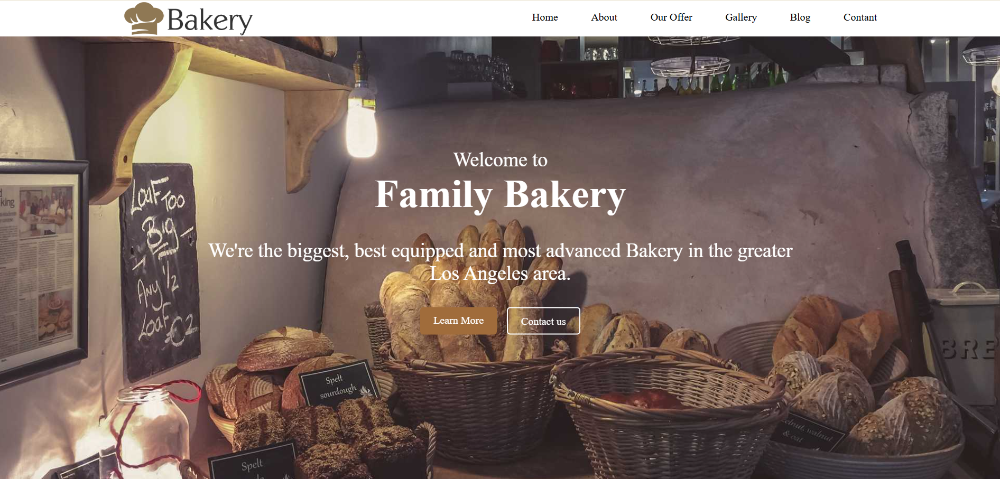

# Bakery
# Bakery Website 🍰

Welcome to the **Bakery Website** project! This is a simple, responsive website designed for a bakery business. It showcases the bakery's offerings, services, and contact information.
This project is part of my current course at **Route Academy**. In this assignment, I built a simple yet elegant webpage using **HTML** and **CSS**. Below is a breakdown of the sections included in this project:
<br>
<br>


---

## Features ✨
- **Home Section**: A welcoming intro with a beautiful hero image.
- **Menu**: Display of delicious bakery items.
- **About Us**: Information about the bakery and its story.
- **Services**: Overview of services like custom cakes, catering, etc.
- **Contact**: Easy way for customers to get in touch.

---

## Technologies Used 💻
- **HTML**: For structuring the website.
- **CSS**: For styling and responsiveness.
---

## How to Run 🛠️
1. Clone the repository:
   ```bash
   git clone https://git@github.com:toka09/Bakery.git
